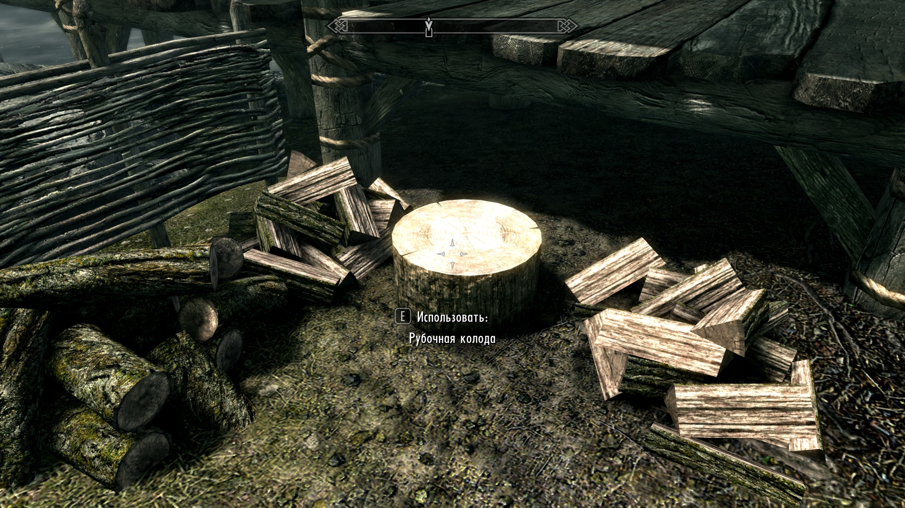

# skyrim_chopping_wood

Script for chopping wood in Skyrim.

## Usage

1. Install using pip:

```
pip install git+https://github.com/SalavatD/skyrim_chopping_wood.git
```

2. Run `cmd.exe` with Administrator Rights.
3. Display help for usage details:

```
python -m skyrim_chopping_wood --help
```

4. Start the game and go to the chopping deck so that message appears chopping wood:

<details>
<summary>Screen</summary>

</details>

5. Use `Alt+Tab` to switch to `cmd.exe` window and run the script:

```
python -m skyrim_chopping_wood
```

6. Switch with `Alt+Tab` back to the game window. Wood chopping should start automatically.
7. To stop chopping wood, switch with `Alt+Tab` to the `cmd.exe` window and press `Ctrl+C`.
